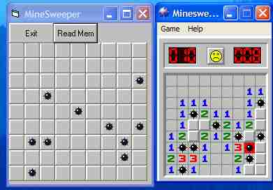



## Minesweeper Cheat

### Description

AFter learning how to use the API call ReadProcessMemoy, I made this. It discoveres the locations of the hidden mine's in the game MineSweeper. Just load the game then run this program.
 
### More Info
 

             |
---                |---
**Submitted On**   |2003-09-14 09:40:04
**By**             |[IRBMe](https://github.com/Planet-Source-Code/PSCIndex/blob/master/ByAuthor/irbme.md)
**Level**          |Intermediate
**User Rating**    |4.8 (81 globes from 17 users)
**Compatibility**  |VB 5\.0, VB 6\.0
**Category**       |[Windows API Call/ Explanation](https://github.com/Planet-Source-Code/PSCIndex/blob/master/ByCategory/windows-api-call-explanation__1-39.md)
**World**          |[Visual Basic](https://github.com/Planet-Source-Code/PSCIndex/blob/master/ByWorld/visual-basic.md)
**Archive File**   |[Minesweepe1645209142003\.zip](https://github.com/Planet-Source-Code/irbme-minesweeper-cheat__1-48490/archive/master.zip)

